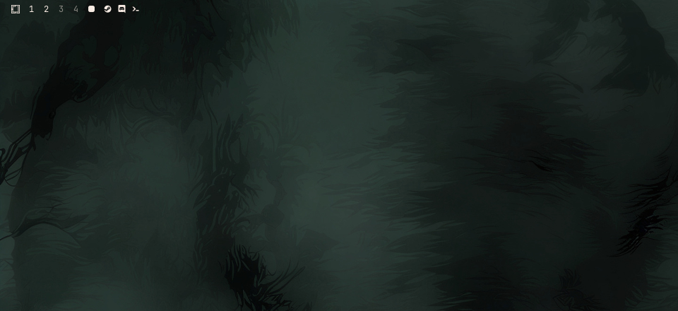

# Minimized windows — Omarchy bar widget



A Quickshell bar widget for **Omarchy** that tracks windows minimized to
Hyprland's `special:minimized` workspace and shows one clickable Nerd Font
icon per window in the bar. Clicking an icon restores that exact window.

Replaces the original Waybar module with a native Omarchy plugin: the bar
widget itself does no polling and no `socat`. It reads Quickshell's Hyprland
models, so icons update instantly on `openwindow`/`closewindow`/`movewindow`/
workspace events. Restore (click or the optional keybind script) issues a
single sequential `hyprctl` chain so float/geometry cannot race the workspace
move.

## Features

- **Event-driven**: renders straight from Quickshell's Hyprland models — no
  polling, no subprocesses.
- **Per-window icons**: one button per minimized window; clicking an icon
  restores that specific window (not just the most recent one).
- **Smart icons**: per-class Nerd Font glyphs with fuzzy fallbacks
  (ghostty/terminal, chrome/firefox/brave, nautilus/thunar, spotify, code, ...).
- **Floating-state memory**: floating flag and geometry are snapshotted before
  minimize and re-applied on restore, surviving Hyprland's tendency to drop
  them across special-workspace round-trips.
- **No IPC surface**: restoring happens via bar clicks or your own keybind
  running the bundled `restore-last.sh` — nothing else can trigger it.

## Prerequisites

- **Omarchy** (Quickshell shell + Hyprland)
- A **Nerd Font** in the bar (the default Omarchy font already is one)

## Installation

From anywhere (installs into `~/.config/omarchy/plugins/dev-herni.minimized`):

```bash
omarchy plugin add https://github.com/Dev-Herni/waybar-minimize-plugin.git --enable --yes
```

Or add the bar widget from the Omarchy settings UI (`omarchy menu` -> Settings ->
Bar), picking **Minimized windows** from the widget catalog.

## Keybindings

The widget needs no configuration. Add whatever keybinds you like to
`~/.config/hypr/bindings.lua` — the two basics are plain Hyprland dispatches,
no plugin involved:

```lua
-- Minimize the focused window into the hidden workspace
o.bind("SUPER + M", "Minimize window", "hyprctl dispatch 'hl.dsp.window.move({ workspace = \"special:minimized\", follow = false })'")

-- Show / hide the minimized-windows overlay
o.bind("SUPER + ALT + M", "Toggle minimized overlay", "hyprctl dispatch 'hl.dsp.workspace.toggle_special(\"minimized\")'")
```

### Optional: a restore-last keybind

Restoring a specific window is one click on its bar icon. If you also want a
keyboard shortcut for "restore the most recently minimized window", bind the
small script that ships with this plugin:

```lua
o.bind("SUPER + SHIFT + M", "Restore last minimized window", "~/.config/omarchy/plugins/dev-herni.minimized/restore-last.sh")
```

The script talks straight to Hyprland (`hyprctl` + `jq`, both ship with
Omarchy). The plugin itself exposes **no IPC**, so nothing on your system can
trigger restores behind your back — window state only changes when you click
an icon or run the script yourself.

The script restores floating state and saved geometry the same way a bar
click does: it reads the window's current Hyprland client info, then the
widget's snapshot file (`~/.local/state/omarchy/dev-herni.minimized.json`)
if Hyprland dropped the floating flag while the window was parked.

## How it works

- Minimizing moves the focused window to the special workspace
  `special:minimized` (persistent overlay, visible when toggled).
- The widget watches that workspace's toplevels and shows one icon per window,
  ordered by focus history.
- Clicking an icon moves that window back to the active workspace, re-applies
  its floating state/geometry if it had any, focuses it, and closes the
  special-workspace overlay if nothing else is showing, using Hyprland's Lua
  dispatcher syntax:
  `hyprctl dispatch 'hl.dsp.window.move({ window = "address:0x...", workspace = <id>, follow = false })'`.

## License

[MIT License](LICENSE)

## Removal

```bash
omarchy plugin remove dev-herni.minimized --yes
```

The plugin creates no files outside its own folder.
